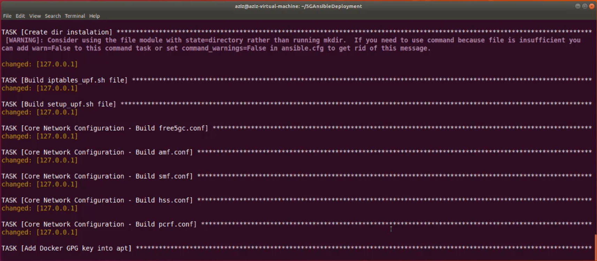
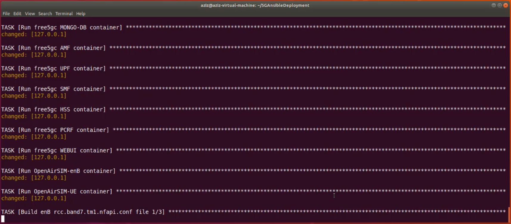
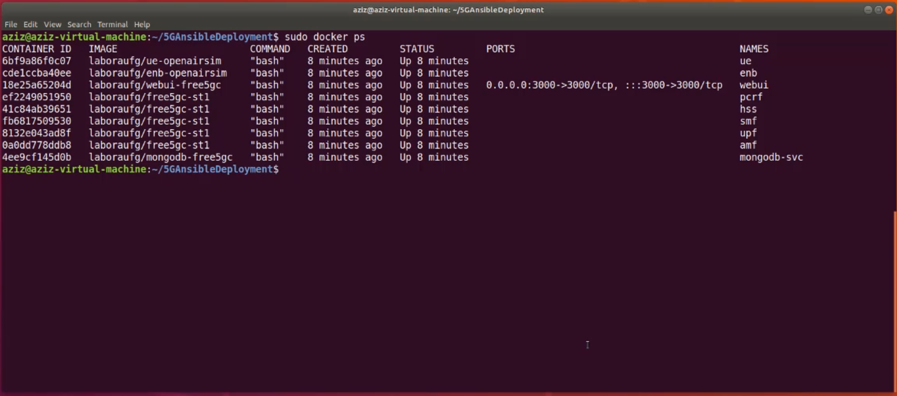
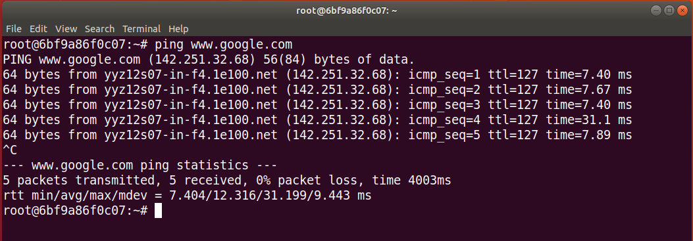

# Docker Deployment with Security Implementation


### Docker-based Network Deployment Steps                
Follow the steps to deploy the network.

**1. Installing Prerequisites:**

Use the following commands to install the prerequisites including updating, installing Python and Ansibe:
    
```
sudo apt-get update
sudo apt-get install python-minimal
sudo apt -y install ansible
```

**2. Running Ansible Playbook to Deploy the Network:**

Deploy the network using the following command:

``` ansible-playbook -K [Name of file].yml -e "internet_network_interface=[network interface name] ```

Replace the [Name of file] with the name of the playbook. Also, replace [network interface name] with the name of the interface. This can be found using ```ifconfig``` command.

Once the command runs, it starts to set up the network and configures the core network functions from Free5GC. This process of configuration is shown in the Figure.



Ansible runs all the network entities in separate containers. This process is shown in the Figure.



**3. Verifying the Deployed Network:**

We verify the running containers using the command:

``` sudo docker ps ```

This command shows all the running containers in the system and this is shown in the Figure.



**4. Verifying the Internet Connectivity:**

Now test the internet connectivity of the UE once the network is deployed. Access the UE container via the terminal using the following command:

``` docker exec -ti ue bash ```

Now verify the connectivity using Ping command:

``` ping google.com ```


